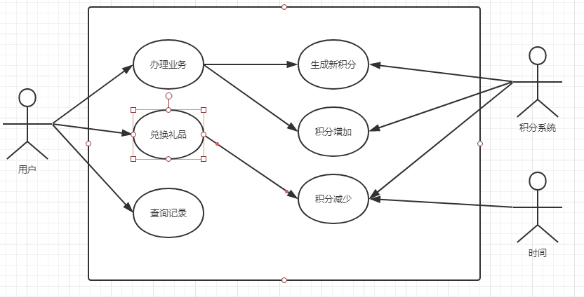
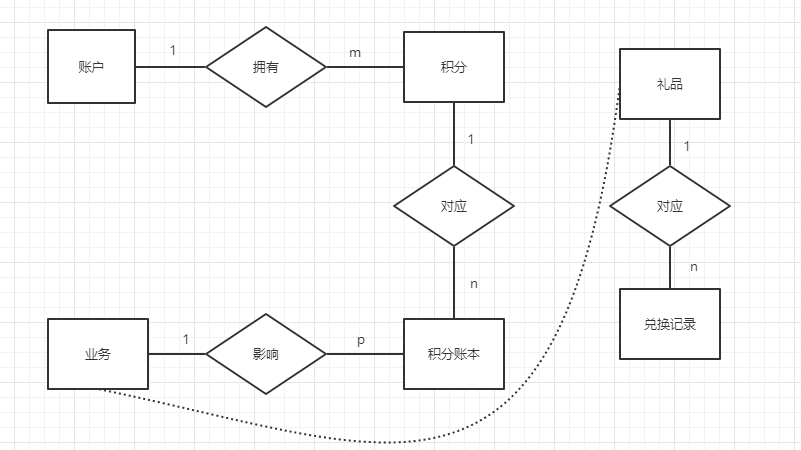

# 积分管理系统

## 目的任务

设计一个电信积分模型，支持积分生成、积分兑换等功能。

参考要求如下：

1. 积分生成
   - 可以根据用户的等级、消费情况等属性来综合计算积分，按月计算
   - 参与营销活动的时候根据活动情况实时赠送积分，赠送的积分有有效期
2. 积分兑换
   - 支持积分换礼品，需要记录积分具体扣减明细和兑换礼品的记录
3. 积分查询
   - 支持查询积分的当前总值、当前可用值
   - 支持查询积分生成、兑换的记录

## 设计内容

参考积分域的模型定义：不是所有的模型都需要建，根据需要。

积分域包括：积分帐户、积分帐本、积分计划、积分计算规则、积分计算明细、积分帐本变更历史、积分兑换明细、礼品、积分兑换规则、积分类型等实体信息。

1. 积分帐户记录客户、用户、帐户的积分累计和消费的基础信息；
   - 一个积分帐户对应一个积分帐本或多个积分帐本
2. 积分计划是客户积分每月如何计算积分的描述，积分计划由一组积分计算规则组成。
   - 一个积分帐户对应一个积分计划或多个积分计划，当同一时间段有多个积分计划时候，以优先级高的积分计划计算积分。
3. 积分计算规则是具体描述了客户积分计算的细则，是积分计划如何计算的客户积分展开的详细描述。
   - 一个积分计划对应一个积分计算规则或多个积分计算规则。
4. 积分帐本是指登记积分帐户累积以及兑换、消耗关系的帐簿。积分帐本以积分帐本标识、积分类型为单元登记积分帐户的收支关系。
   - 一个积分帐户拥有一个或多个积分帐本。
   - 一个积分类型对应一个或多个积分帐本。
5. 积分帐本变更历史是指积分帐本变更历史详细记录，用于记录积分帐本的变更轨迹。
   - 一个积分帐本对应一个或多个积分帐本变更历史记录。
6. 积分类型是对积分帐本的分类，用来区别不同种类的积分。
   - 一个积分类型对应一个或多个积分帐本。
7. 礼品用于积分兑换自有类、合作类、实物类物品的简单描述。
8. 积分兑换规则是用于描述积分如何兑换礼品的规则
9. 积分兑换明细是指积分帐户兑换的礼品的详细记录。
10. 积分计算明细用于保存出帐相关的批量计算的客户积分明细信息，营销单次产生或合作伙伴等产生的积分可以不需要在这里记录。

## 设计理念

- 易于修改与移植
  要求数据库层面灵活易改，而且考虑到积分功能经常要嵌入到移动其他业务作为点缀，所以要求即使去掉所有前端和后端部分，数据库仍然能正常工作，保持相对独立和稳定。
- 高内聚低耦合
  前端，后端与数据库三者之间的依赖与联系要尽量小。同时，各个模块内部要达到较强的稳定性和鲁棒性。
- 错误提示，用户友好型
  错误提示尽量完备，让维护人员和用户的工作尽量便捷

## 需求分析

用例图：

ER图：

数据库定义了六个实体，分别是账户实体，积分实体，积分账本实体，业务实体，礼品实体和兑换记录实体。关键因素在于积分的变化，对其影响因素有业务执行和积分失效。

## 数据库设计

具体见 [数据库设计](./db/README.md)

## 前后端设计

后端服务器设计具体见 [后端设计](./server/README.md)。

前端设计具体见 [前端页面设计](./client/README.md)。

## 总结和展望

这一次数据库课程设计采取了非常冒险的行为，因为前后端设计严重滞后，数据库设计为了减轻程序设计压力，并且基于需求随时变化的前提下，将大部分功能集成于数据库内部，所以造成了数据库里有大量的触发器和存储过程。所谓高内聚低耦合也是被逼无奈的结果。之后询问过负责工程师，实际工程中并不会采取这样子的做法，不过工程师默许了我这样子的措施。

实际做起来发现这样子有一定的可行性，因为数据库设计领先于前后端设计两个余月，所以数据库得到了充分的测试，有足够的鲁棒性和稳定性，可能牺牲掉的就是效率，可能由于高度耦合的缘故，并发性测试并不理想。不过考虑这次的主题，明显对于数据安全的考虑要放在第一位，为了避免网络传输过程中信息泄露，尽可能减少前后端的信息交互，将必须交互的信息进行加密，而且数据库存储密文，尽可能提高安全性，以此为代价是牺牲了效率，由此可以看出安全性和效率二者是不可以兼得的。

通过这次课程设计，深刻了解了需求分析的重要性。另外，mysql 自身提供的调试能力非常孱弱，在编写存储器和触发过程中遇到了数不胜数的困难，虽然保证了高度聚合，却牺牲了程序开发效率，这在工程上是得不偿失的，这是我在这次课程设计中得到的最大的经验与教训。
