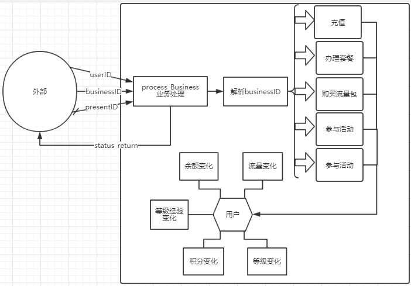
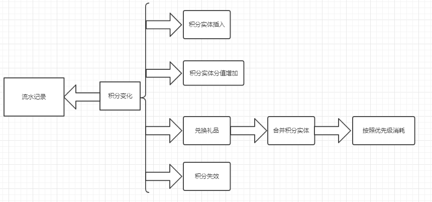
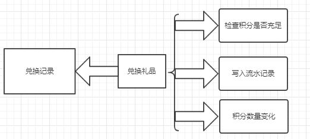

# 数据库设计

## 数据库表设计

账户表：

```markdown
> Account					账户Table			数据类型			属性限制
> ├ userID					账户ID				char(16)			not null | unique | primary key
> ├ password				登录密码	    	varchar		    	not null
> ├ realName				真实姓名	    	varchar
> ├ netInDate				入网日期        	date		    	not null
> ├ birth					出生年月	    	date
> ├ telephone				联系电话        	char(11)	    	not null | unique
> ├ address					地址	        	varchar
> ├ levelPoints				账户经验	    	int(6)		    	not null
> ├ level			    	账户等级	    	int(4)		    	not null
> ├ currentBalance			现有总积分	    	int(6)		    	not null
> ├ currentIntegral			现有余额			int(6)				not null
>----------------------------------------------------------------------------------------------------------------------
> ├ trigger
> ├--Auto_insert_Account						BEFORE	INSERT		# 插入账户实体时只需要手机号码和密码，其他自动生成
> ├--Auto_generate_signInIntegral				AFTER	INSERT		# 插入账户实体后自动生成签到积分实体（2001）
> ├--Auto_generate_telefareIntegral				AFTER	INSERT		# 插入账户实体后自动生成话费积分实体（2001）
>----------------------------------------------------------------------------------------------------------------------
> ├ procedure(or function)
> ├--insert_Account						IN _telephone CHAR(11), IN _password VARCHAR(255)
> ├--update_Account_address				IN _userID CHAR(16), IN _address VARCHAR(255)
> ├--update_Account_password			IN _userID CHAR(16), IN _password VARCHAR(255)
> ├--update_Account_realName			IN _userID CHAR(16), IN _realName VARCHAR(255)
> ├--change_Account_currentBalance		IN _userID CHAR(16), IN change_balance INT
> ├--change_Account_levelPoints			IN userID_in CHAR(16), IN change_levelPoints INT
```

业务表：

```markdown
> Business					业务Table			数据类型			属性限制
> ├ businessID				业务ID				CHAR(16)			not null | unique | primary key
> ├ issueDate				发布日期			date 				not null
> ├ businessName			业务名称			varchar				not null | unique
> ├ businessType			业务类型			int(4)				not null
> ├ changeBalance			余额变化			int(6)
> ├ changeIntegral			积分变化			int(6)
> ├ changeLevelPoints		等级经验变化		int(6)
>----------------------------------------------------------------------------------------------------------------------
> ├ trigger
> ├--Auto_insert_Business						BEFORE 	INSERT		# 插入业务实体时自动插入发布时间
>----------------------------------------------------------------------------------------------------------------------
> ├ procedure(or function)
> ├--process_Business					IN _userID CHAR(16), IN _businessID CHAR(16), IN _presentID CHAR(16)
```

积分表：

```markdown
> Integral					积分Table			数据类型			属性限制
> ├ integralID				积分ID				char(16)			not null | unique | primary key
> ├ userID			        账户ID	            char(16)			not null | foreign key
> ├ integralType	        积分类型	        int(4)				not null
> ├ value			        分值	            int(6)				not null
> ├ startDate		        获得日期            date				not null
> ├ expDate			        截止日期	        date				not null
>----------------------------------------------------------------------------------------------------------------------
> ├ trigger
> ├--Auto_insert_Integral						BEFORE	INSERT		# 插入积分实体时只需要账户ID，积分分值，积分类型和失效日期，其他自动填充
> ├--insert_value_to_currentIntegral			AFTER	INSERT		# 插入积分实体时自动更新对应账户的现有总积分
> ├--update_value_to_currentIntegral			AFTER	UPDATE		# 更新积分实体时自动更新对应账户的现有总积分
> ├--insert_ifnotexpDate_rollback				BEFORE	INSERT		# 不允许插入过期的积分实体
> ├--update_ifnotexpDate_rollback				BEFORE	UPDATE		# 不允许更新过期的积分实体
>-----------------------------------------------------------------------------------------------------------------------
> ├ procedure(or function)
> ├--insert_Integral					IN _userID CHAR(16), IN _value INT, IN _integralType INT, IN _expDate
> ├--update_Integral_expDate			IN _integralID CHAR(16), IN _expDate DATE
> ├--change_Integral_value				IN _integralID CHAR(16), INOUT change_value INT
```

礼品表：

```markdown
> IntegralChangeRecord		积分记录Table		数据类型			属性限制
> ├ changeID				积分记录ID			char(16)			not null | unique | primary key
> ├ integralID              积分ID              char(16)            not null | foreign key
> ├ changeValue             变化分值	        int(6)              not null
> ├ changeTime              变化时间            datetime            not null
> ├ reason                  变化原因            CHAR(16)            not null | foreign key
> ├ reasonExtra		        原因补充	        char(12)
>----------------------------------------------------------------------------------------------------------------------
> ├ trigger
>-----------------------------------------------------------------------------------------------------------------------
> ├ procedure(or function)
> ├--Auto_Insert_ICR					CHAR(16) = (_integralID CHAR(16), _changeValue INT, _reason CHAR(16))
> ├--update_ICR_reasonExtra				IN ICRID CHAR(16), IN _reasonExtra CHAR(16)
```

优先级表：

```markdown
> Priority					优先级Table			数据类型			属性限制
> ├ priorityID				优先级ID			char(16)			not null | unique | primary key
> ├ changeTime	            更改时间		    datetime	        not null
> ├ First_pr	            第一优先级（1）	    int(4)		        not null
> ├ Second_pr	            第二优先级（2）	    int(4)		        not null
> ├ Third_pr	            第三优先级（3）	    int(4)		        not null
> ├ Fourth_pr	            第四优先级（4）	    int(4)		        not null
> ├ Fifth_pr	            第五优先级（5）	    int(4)		        not null
> ├ Sixth_pr	            第六优先级（6）	    int(4)		        not null
>----------------------------------------------------------------------------------------------------------------------
> ├ trigger
> ├--Auto_insert_Priority						BEFORE	INSERT		# 插入优先级时只需要各个积分类型的优先级，其他自动填充
>----------------------------------------------------------------------------------------------------------------------
> ├ procedure(or function)
> ├--GetPriority						OUT First INT, OUT Second INT, OUT Third INT, OUT Fourth INT, OUT Fifth INT, OUT Sixth INT
```

礼品表：

```markdown
> Present					礼品Table			数据类型			属性限制
> ├ presentID				礼品ID				char(16)			not null | unique | primary key
> ├ presentName		        礼品名              varchar		        not null | unique
> ├ presentType		        礼品类型            int(4)              not null
> ├ presentPrice	        礼品价值            double(10,2)        not null
> ├ costIntegral	        消耗积分            int(6)              not null
> ├ presentNum			    礼品数量            int(8)              not null
>----------------------------------------------------------------------------------------------------------------------
> ├ trigger
> ├--Auto_insert_Present						BEFORE	INSERT		# 插入礼品时只需要给出礼品名，礼品类型，礼品价值，消耗积分和礼品数量，其他自动填充
> ├--update_presentNum_to_PER					AFTER	UPDATE		# 礼品数量减少（限定减少1）时自动向兑换记录插入记录
>-----------------------------------------------------------------------------------------------------------------------
> ├ procedure(or function
> ├--insert_Present						IN _presentName VARCHAR(200), IN _presentType INT, IN _presentPrice INT, IN _costIntegral INT, IN _presentNum INT
> ├--update_Present_costIntegral		IN _presentID CHAR(16), IN _costIntegral INT
> ├--update_Present_presentNum			IN _presentID CHAR(16), IN _presentNum INT
> ├--update_Present_presentPrice		IN _presentID CHAR(16), IN _presentPrice INT
```

兑换记录表：

```markdown
> PresentExchangeRecord		兑换记录Table		数据类型			属性限制
> ├ exchangeID				兑换记录ID			char(16)			not null | unique | primary key
> ├ presentID	            礼品ID	            char(16)    		not null | foreign key
> ├ exchangeTime            兑换日期	        datetime			not null
>----------------------------------------------------------------------------------------------------------------------
> ├ trigger
>-----------------------
> ├ procedure(or function)
>-----------------------
```

## 数据库操作流程

遵照一开始的设计原则，数据库内部保证高度聚合，只向外部提供一个接口。高度聚合通过各种触发器和存储过程实现内部自治稳定，外部接口通过提供一个存储过程给后端，不允许后端执行接口以外的更新操作。

以下给出数据库与外部操作的关系图：



后端传入 账户ID，业务ID，礼品ID（兑换礼品使用），同时需要数据库传回一个状态码以便得知数据库操作是否成功。

数据库对外提供接口为 `process_Business(userID, businessID, presentID, status_return)`。

数据库收到后端传来的 业务ID 后，解析其 ID 并导入不同的业务处理函数，一旦业务处理过程中出错或者业务办理不满足要求时，返回错误状态码，告诉后端数据库处理错误。

**积分变化的处理过程**



影响积分变化的因素有业务办理和积分失效积分包括消费回馈积分和活动积分。

活动积分有效期较短，容易失效。业务办理会紧接着积分变化，秉承先写流水记录再执行积分变化的原则，这之中牵扯到积分实体变化引起的账户总积分变化。

另外兑换礼品引起的积分减少，首先要根据积分优先级合并相关积分实体，然后对应减少分值，将分值变化写入流水记录。积分失效用定时计划事件实现，每天凌晨 0 点将失效的积分实体分值清零。

**礼品兑换的处理流程**



礼品兑换需要礼品ID，这是后端一开始就传入的数据。礼品兑换时牵扯到账户余额，积分，流量的变化。

## 疑点，难点与创新点

1. 数据库规范化
   - 所有表都消除了非主属性对主属性的完全依赖，达到了3NF甚至BCNF
2. 原子操作
   - 由于数据库只对外提供了一个接口，所以必须保证这个接口稳定可靠。
   - process_Business 这个接口考虑到了原子操作性，一个步骤出错直接回滚，杜绝了非法数据插入或更改的可能性，保证了数据库完整性与安全性。
3. 可移植性
   - 尽可能减少程序设计的压力，数据库自身保持灵活可变行。
   - 添加或者删除业务，添加或删除礼品，调整优先级等要求数据库能够尽量应对需求的随时变化。
4. 数据库安全性
   - 密码等机密信息在数据库里面的存储是密文形式，当然这需要后端的配合。
5. 唯一主键
   - 大部分表采用 唯一ID 为主键，ID 由数据库生成。并且从 ID 可以看出该条记录的部分属性。
6. 并发性测试
   - 数据库设计好后曾经对数据库进行过并发性测试，发现数据库在高度耦合的情况下插入数据的速率会严重下降，这个问题到结束阶段仍然不知道问题在哪里以及如何解决。
