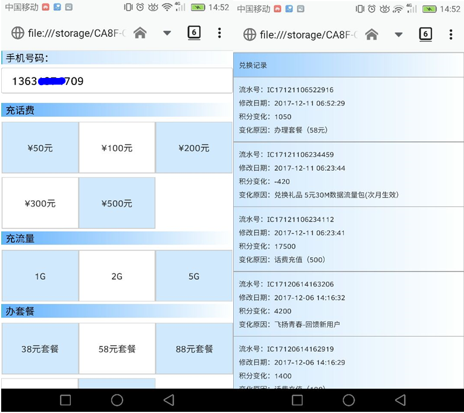

# 前端设计

## 概述

前端实现：HTML+CSS+JavaScript

具体目录结构：

- Content：存放一些资源文件和css文件，用于页面设计
- fonts：存放备用的字体文件
- res：存放一些额外的资源文件，如商品图
- script：存放 js 文件，引进库和一些跳转动作
- *.html：主要的网页文件

## 实现

1. 登录实现
   - 用户在界面输入手机和密码，js 通过使用 ajax 通信，链接服务端校验账户信息的 query_Account.php，根据返回结果，决定是登录成功，用户不存在或者密码错误，数据库错误，网络错误等；
   - 此外，密码验证方式使用了简单的 rsa 算法思路加密，数据库端存放的也是密文形式的密码，可以一定程度上防止密码无意中泄露，比如被人看到之类的。
2. 主界面信息实现
   - 主界面获取登录界面传递的信息，向服务端获取信息并显示；
3. 充值界面实现
   - 每种充值有各自的 businessID，根据对应的 id，向服务端发起数据库操作请求，也是根据返回结果决定该显示充值成功还是其他；
4. 记录界面实现
   - 同主界面通信类似，返回根据时间排序，显示所有的充值信息；
5. 充值界面实现
   - js 先用 ajax 得到商品列表，再显示在 html 上，对应的商品有各自的 id，发起一次购买同充值功能类似，根据返回值显示不同的结果；
6. 活动界面
   - 活动是具体的 business，所以同样是根据与服务端的通信结果，显示不同的信息。

## 界面实现

登录界面：

充值界面：

礼品界面：

